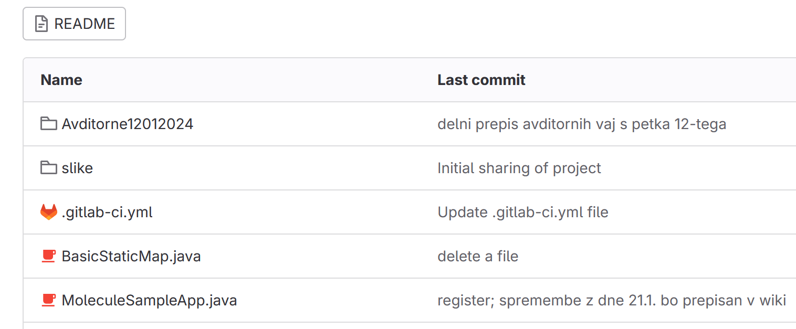
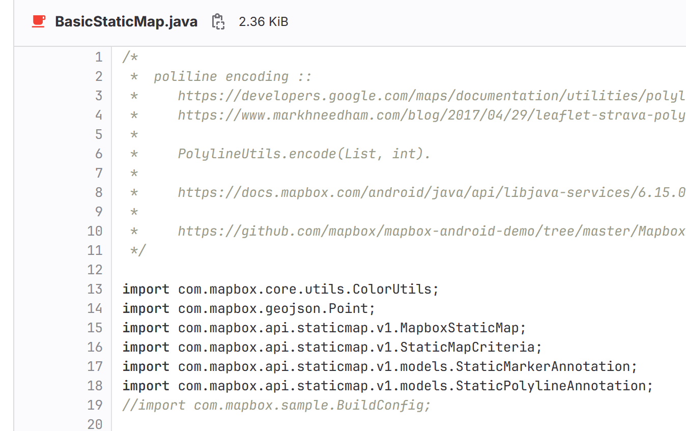
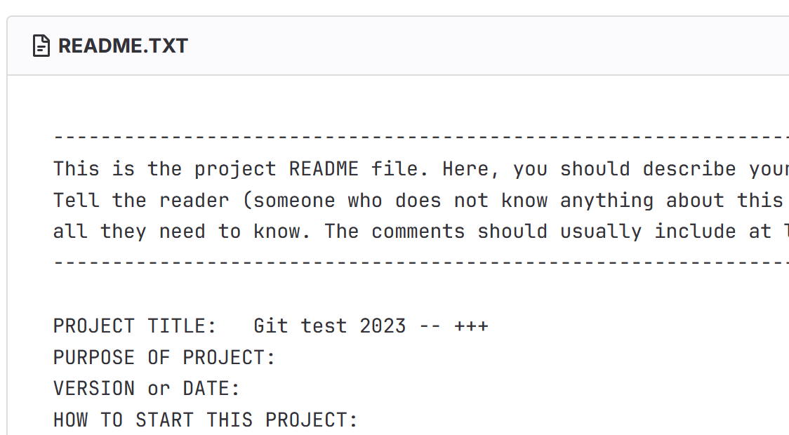
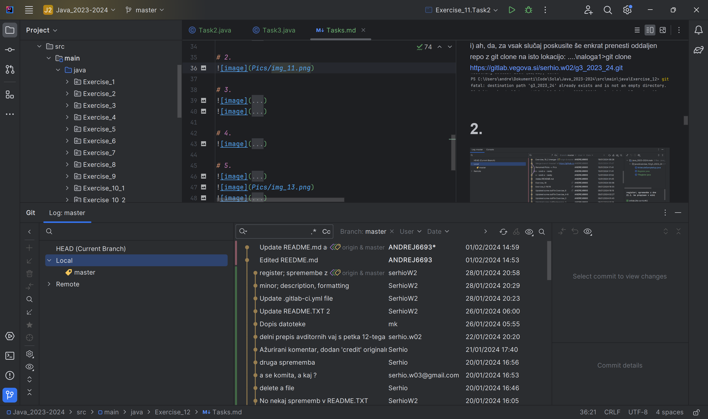
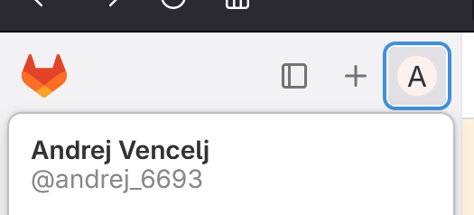
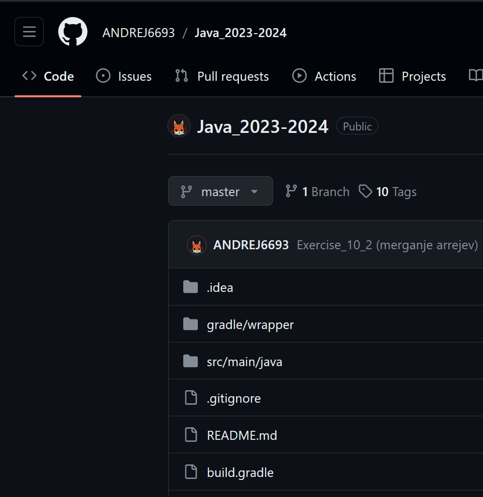
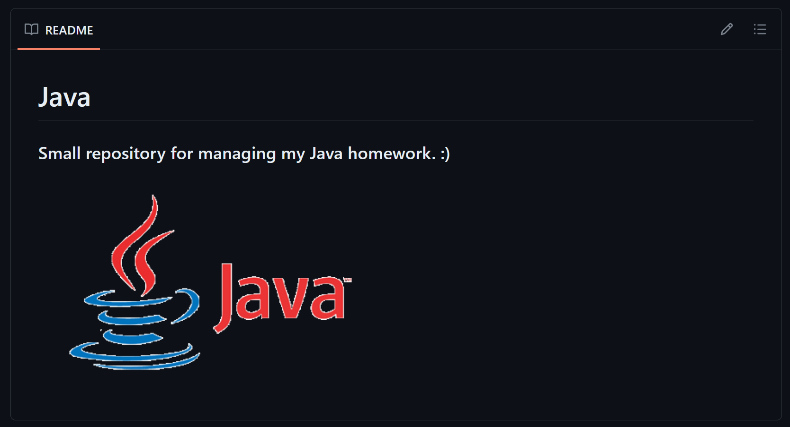
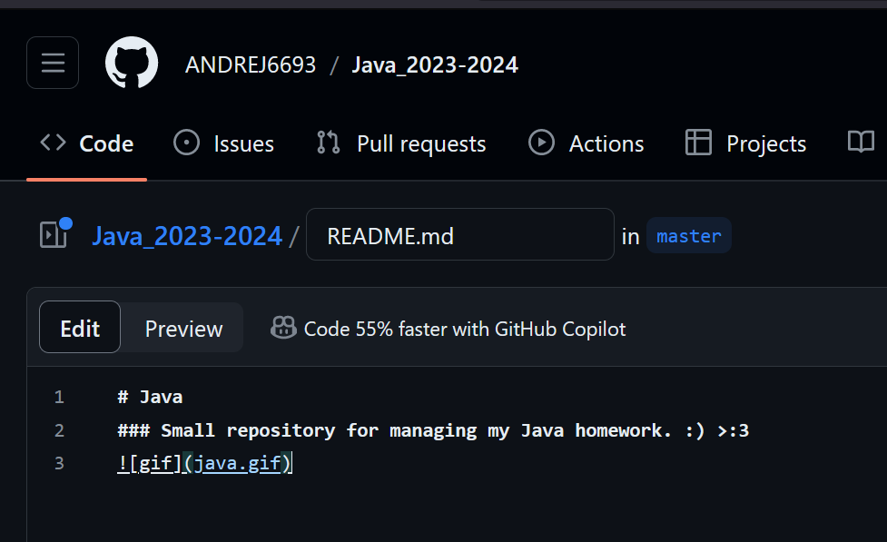
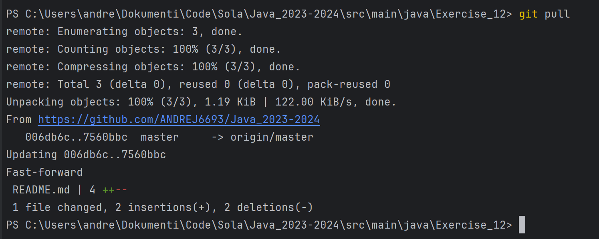

## 1.

a) ali opazite, da na spisku dobite več datotek, nekaj jih je celo v lastnih mapah ?
- Ja.

  

b) ali si lahko ogledate vsebino posamezne datoteke, tako da na spisku kliknete nanjo ?
- Ja.

  

c) vsebina katere izmed datotek s spiska je prikazana pod spiskom datotek ?
- REEDME.TXT.

  

d) kateri so javni repozitoriji uporabnika serhio.w02 ?
- teli:

  

e) kateri IDE so s strani gitlab Vegove podprti?

f) preverite, če je git odjemalec dosegljiv. V poročilo naj gre rezultat izvedbe : ...\naloga1>git -v.

g) prenešena vsebina je BlueJ paket. Preverite, če lahko projekt odprete iz mape g3_2023_24.

h) vsebine repozitorija, ki ste jih prenesli, so v bistvu 'trash projekt', oz. rezultat parih testiranj,
brez dodatnega posega z vsaj nekaj vizualizacije deluje samo tisti Molecule ... ***Preskus ni obvezen***.

i) ah, da, za vsak slučaj poskusite še enkrat prenesti oddaljen repo z git clone na isto lokacijo:
....\naloga1>git clone https://gitlab.vegova.si/serhio.w02/g3_2023_24.git

# 2.
Uporabljam intillj tako da zgleda malo drugače kakor bi zgledalo v blueJ-ju. iz slik se vidi da je IDE povezan z git-om.

# 3.

# 4.

# 5.

# 6.

